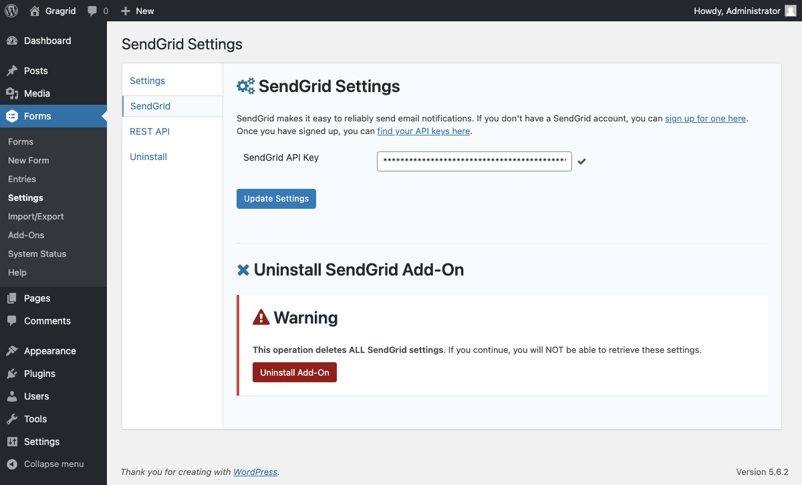
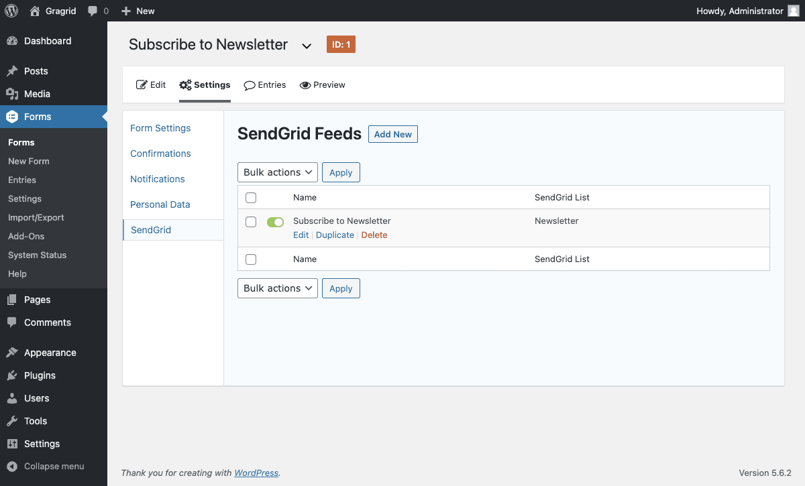
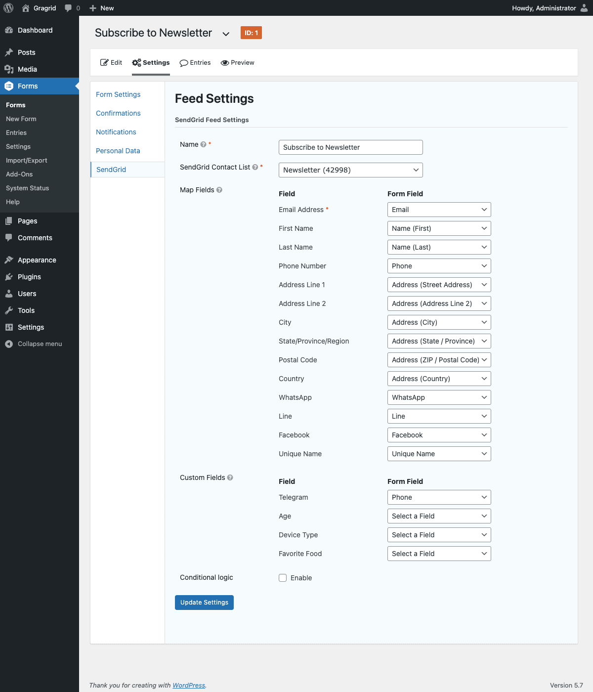

# Gragrid: Gravity Forms + SendGrid

[](https://github.com/vlasscontreras/gragrid)
[](https://github.com/vlasscontreras/gragrid)
[](https://wordpress.org/plugins/gragrid/)
[](https://github.com/vlasscontreras/gragrid)
[](https://github.com/vlasscontreras/gragrid)
[](https://github.com/vlasscontreras/gragrid)
[](https://wordpress.org/plugins/gragrid/)

Integrates Gravity Forms with SendGrid, allowing form submissions to be automatically sent to your SendGrid contact lists.





## Hooks

```php
apply_filters( 'gragrid_request_args', array $args, string $path )
```

Filters the remote request arguments used when communicating with the SendGrid API.

### Parameters

- `$args` (array): Request arguments, includes headers, method, body, etc.
- `$path` (string): The specific API endpoint being called.


```php
apply_filters( 'gragrid_contact_params', array $contact_params, array $entry, array $form )
```

- `$contact_params` (array): Contact parameters, includes first name, email, custom fields, etc.
- `$entry` (array): The form entry that was just created.
- `$form` (array): The current form, the origin of the submission.

_Inspired by [Gravity Form Mailchimp Add-On](https://www.gravityforms.com/add-ons/mailchimp/)._
