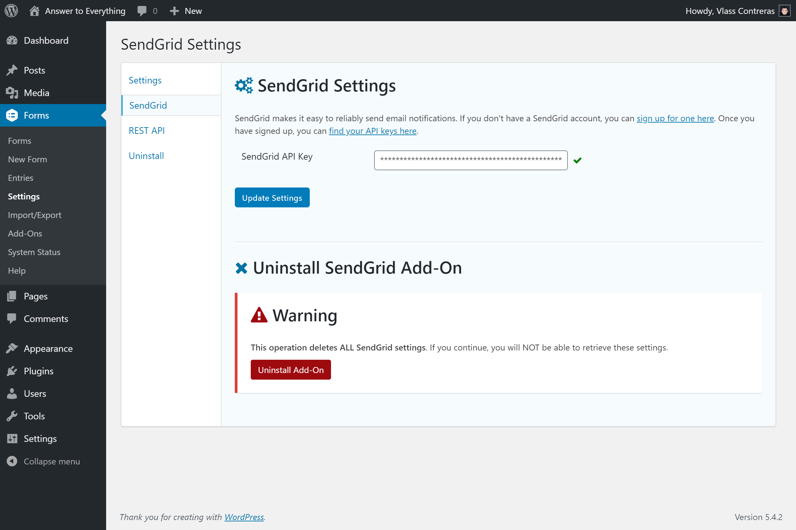
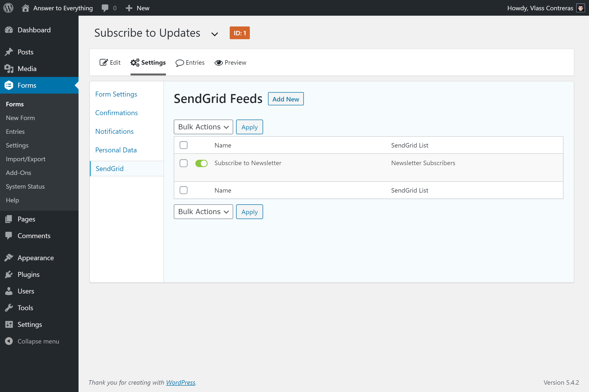
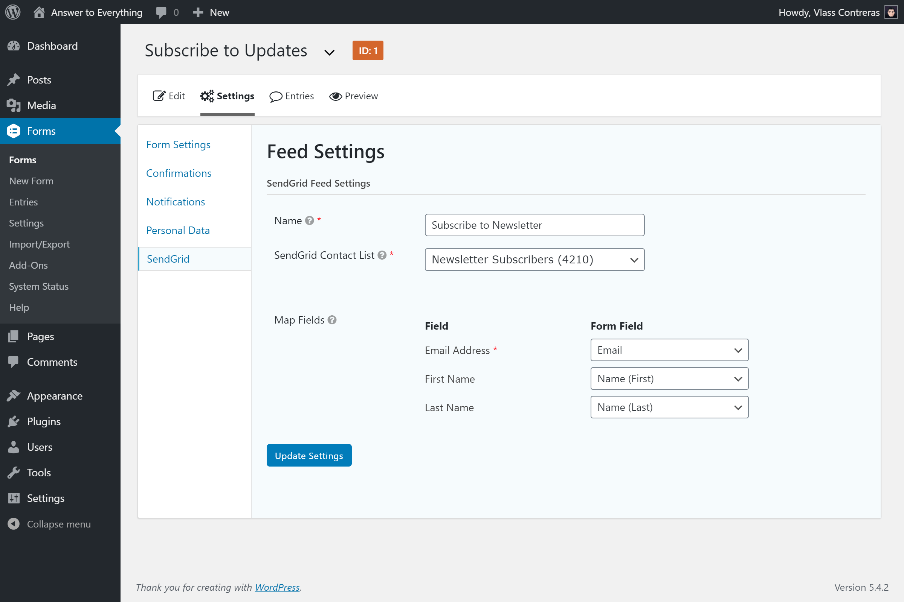

# Gragrid: Gravity Forms + SendGrid

Integrates Gravity Forms with SendGrid, allowing form submissions to be automatically sent to your SendGrid contact lists.

_Inspired by [Gravity Form Mailchimp Add-On](https://www.gravityforms.com/add-ons/mailchimp/)._
